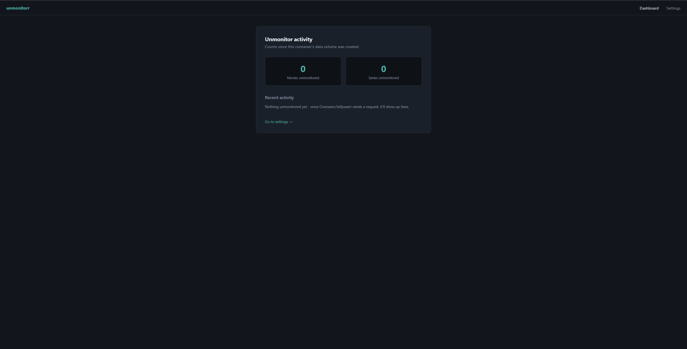
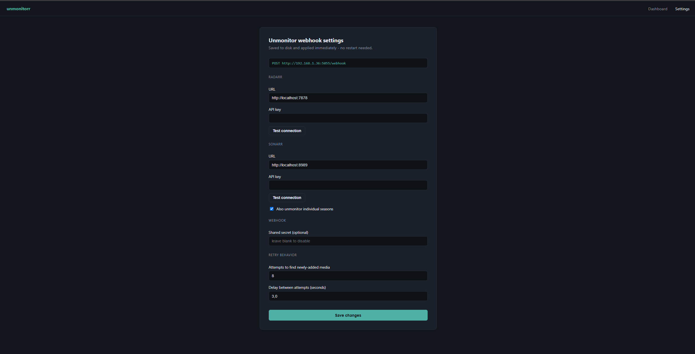

<div align="center">

# 🛑 unmonitorr

**Stop Overseerr/Jellyseerr from auto-monitoring everything it requests.**

[](https://github.com/nicolas-gatta/unmonitorr/actions/workflows/docker-publish.yml)
[](LICENSE)
[](https://www.python.org/)
[](https://github.com/nicolas-gatta/unmonitorr/pkgs/container/unmonitorr)

</div>

---

## The problem

[Overseerr](https://overseerr.dev/) and [Jellyseerr](https://github.com/Fallenbagel/jellyseerr) are great front ends for requesting media, but when a request gets approved, they always add the movie/series to [Radarr](https://radarr.video/) or [Sonarr](https://sonarr.tv/) as **monitored** — with no setting to change that. There's no built-in way to say "add it, but don't auto-monitor it," and any manual changes you make later can get silently reverted the next time Overseerr/Jellyseerr syncs.

**unmonitorr** sits between them and Radarr/Sonarr: it listens for the request-approved webhook and flips the item to unmonitored the moment it's added — once, and only once. Anything you monitor manually afterwards is never touched again.

## Features

- 🪝 **Reacts instantly** to Overseerr/Jellyseerr's webhook — no polling, no scheduled sync delay
- 🎬 **Radarr & Sonarr support**, including per-season unmonitoring for series
- 🔒 **Manual changes stick** — since it only ever fires once, at add-time, your own monitoring choices are never overwritten later
- 🖥️ **Web settings page** — configure Radarr/Sonarr URLs, API keys, and behavior straight from the browser, no file editing or restarts
- ✅ **Built-in connection tester** — verify your Radarr/Sonarr URL and API key are valid before saving
- 📊 **Dashboard** — see how many movies/series have been unmonitored and a log of recent activity
- 🐳 **Single lightweight container**, published automatically to GHCR on every push
- 🩺 **Health check endpoint** for monitoring uptime from Portainer, Uptime Kuma, or any dashboard

## Screenshots

<div align="center">

**Dashboard**
<br>


<br><br>

**Settings**
<br>


</div>

## Quick start

```yaml
services:
  unmonitorr:
    image: ghcr.io/nicolas-gatta/unmonitorr:latest
    container_name: unmonitorr
    restart: unless-stopped
    ports:
      - "5056:5055"
    volumes:
      - /opt/unmonitorr/data:/app/data
    environment:
      - TZ=Europe/Brussels
      - LOG_LEVEL=INFO
```

```bash
mkdir -p /opt/unmonitorr/data
chown -R 1000:1000 /opt/unmonitorr/data   # matches the container's fixed UID
docker compose up -d
```

Then open `http://<host>:5056/settings` and fill in your Radarr/Sonarr URLs and API keys — no `.env` file needed.

## Connecting to Overseerr / Jellyseerr

1. **Settings → Notifications → Webhook**
2. **Webhook URL:** `http://<host>:5056/webhook`
3. **JSON Payload:** leave the default template as-is
4. **Notification Types:** enable at least
   - `Request Approved`
   - `Request Automatically Approved`
5. *(Optional)* if you set a webhook secret on the unmonitorr settings page, add a matching `Authorization` header here

## Configuration

All of the below is configurable from the `/settings` page in your browser. Environment variables only *seed* these values the very first time the container starts — after that, the settings page is the source of truth and changes apply immediately, no restart required.

| Setting | Description | Default |
|---|---|---|
| Radarr URL / API key | Where unmonitorr reaches your Radarr instance | — |
| Sonarr URL / API key | Where unmonitorr reaches your Sonarr instance | — |
| Webhook secret | Optional shared secret checked against the incoming webhook's `Authorization` header | disabled |
| Unmonitor seasons | Also unmonitor individual seasons, not just the series | enabled |
| Retry attempts / delay | How long to keep looking for newly-added media before giving up (covers the gap between the webhook firing and Radarr/Sonarr finishing the add) | 8 attempts / 3s |

| Environment variable | Purpose |
|---|---|
| `TZ` | Timezone for log timestamps |
| `LOG_LEVEL` | `INFO`, `DEBUG`, `WARNING`, etc. |
| `CONFIG_PATH` | Where settings are persisted (default `/app/data/config.json`) |
| `STATS_PATH` | Where dashboard stats are persisted (default `/app/data/stats.json`) |

## How it works

```
Overseerr/Jellyseerr ──(webhook: request approved)──▶ unmonitorr ──▶ Radarr/Sonarr API
                                                            │
                                                     set monitored=false
```

Because this only reacts to the approval event — not a recurring scan — anything you monitor by hand afterward is left alone indefinitely.

## Health checks

`GET /healthz` returns `{"status": "ok"}` and is used by the container's built-in `HEALTHCHECK`, so tools like Portainer, Uptime Kuma, or `docker ps` can surface it as healthy/unhealthy automatically.

## Tech stack

- Python 3.12 · Flask · gunicorn
- Single Docker image, built and published via GitHub Actions to GHCR on every push to `main`

## License

[MIT](LICENSE)